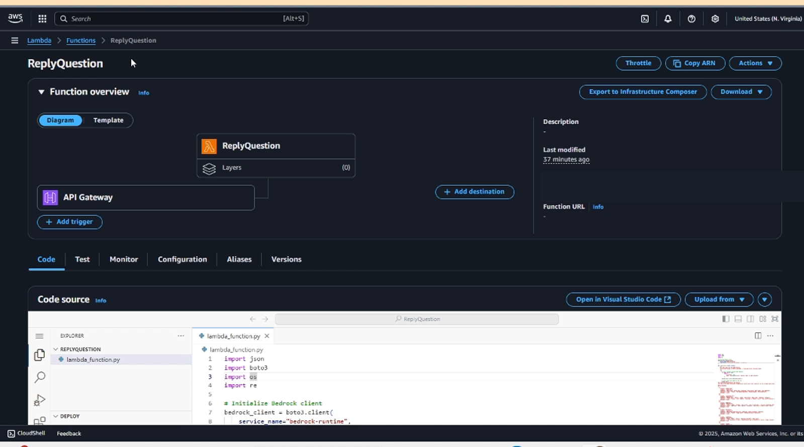
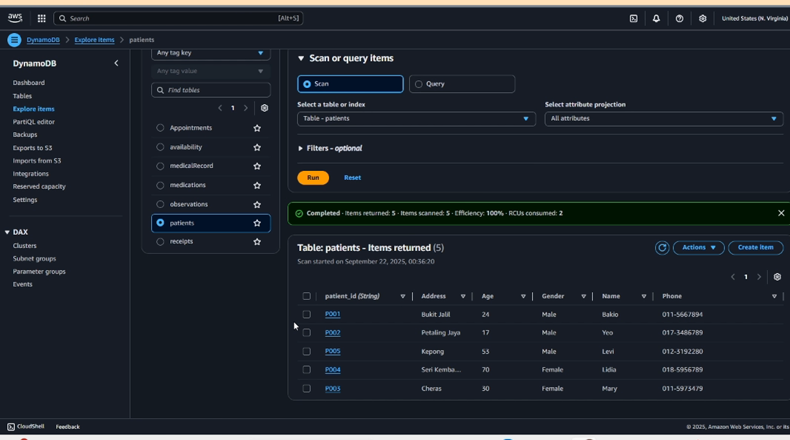

# Clinic Management System, Serverless Edition

A tkinter desktop client that never touches AWS directly: API Gateway +
Lambda + DynamoDB + Bedrock behind one authenticated endpoint, with Amazon
Cognito managing every sign-in, plus an offline demo mode that runs the whole
system with no AWS account at all.

Same four roles and the same seven DynamoDB tables as the original CLI project
(plus a `staff` table kept for the legacy no-Cognito path), but restructured so
the client never touches AWS:

```
Desktop client (tkinter)   Cognito (user pool)        API Gateway (API key)      Lambda (IAM role)
sign in  --------------->  verifies password,  ---->  HTTP POST /call  ------->  verifies JWT,
                           issues access token        {"action": "..."}          role checks, then:
                                                                                 DynamoDB x8
                                                                                 Bedrock (AI consult)

                       or, with no AWS account at all:

Desktop client (tkinter)  -->  DemoBackend (local)  -->  demo_data.json
```

- The client holds **no AWS credentials**. Its only secret is an API key,
  which is not an AWS credential and can be rotated in the API Gateway
  console without redeploying anything.
- Passwords never reach the backend: the client signs in directly against the
  Cognito user pool, and the Lambda verifies the pool's RS256 access tokens
  (pure standard-library verification, no third-party packages in the
  deployment package).
- DynamoDB and Bedrock are reachable **only** from the Lambda execution role.
- The AI consultation now runs inside the backend Lambda, so the client also
  no longer needs the old unauthenticated `ReplyQuestion` endpoint.
- Every AWS-facing code path is still present: the DynamoDB calls in
  `lambda_function.py`, the Bedrock `invoke_model` call, and the `requests`
  POST in the client. Switching the data source to AWS uses all of them
  unchanged. The demo mode is an addition, not a replacement.

## Screenshots

From the original September 2025 deployment on AWS, the project this
repository was rebuilt from. A few names differ from the current `deploy.py`:
the old function was `ReplyQuestion` (its unauthenticated endpoint is gone,
the AI consultation now runs inside the backend), and the `staff` table was
added afterwards for backend login.

AWS Lambda: the API Gateway trigger on the backend function, which reads
DynamoDB and calls Bedrock:



DynamoDB item explorer on the `patients` table (fictional seed data):



## Files

| File | Purpose |
|---|---|
| `lambda_function.py` | The backend. One function, 23 routed actions (including staff and patient sign-in), all DynamoDB and Bedrock access, per-role authorization on every call, and Cognito JWT verification. |
| `deploy.py` | Creates/updates the IAM role, Cognito user pool + app client + accounts, Lambda, REST API, API key and stage. Run once, re-runnable. |
| `AWS Healthcare System Serverless GUI.py` | The desktop client. Signs in against Cognito, talks only HTTPS to API Gateway, or to the local demo backend. |
| `serverless_config.json` | Invoke URL + API key + Cognito pool/client IDs + which data source to use. Keep the key out of git. |
| `demo_data.json` | Seed data for the offline demo (created on first run, edit or delete freely). |

## Two data sources

The sign-in screen has a **Data source** selector. **AWS is the default** (it is
the primary path of this project); the last choice is remembered in
`serverless_config.json`:

| Mode | What it does | Needs AWS? |
|---|---|---|
| **AWS (API Gateway)** (default) | The real path: HTTPS to API Gateway, which invokes the Lambda, which talks to DynamoDB and Bedrock. Requires `deploy.py` to have run. | Yes |
| **Demo (offline)** | A local `DemoBackend` implements all 23 actions with the same checks the Lambda performs (staff login, duplicate patient/receipt IDs, clashing slots, blocked dates, missing fields). Changes persist to `demo_data.json`. The AI consultation returns canned guidance instead of calling Bedrock. | No |

The screens, buttons and error dialogs are identical in both modes, so the demo
is a faithful preview of the deployed system.

### Sessions, Cognito and per-role authorization

Sign-in happens against the Cognito user pool: the client sends the username
and password straight to Cognito over HTTPS, Cognito checks the password and
returns a signed access token, and every later API call carries that token.
The Lambda verifies the token's RSA signature against the pool's public
signing keys (fetched from the pool's JWKS endpoint and cached), then checks
issuer, audience and expiry before looking at anything else.

The authorization matrix is unchanged by any of this and lives in the
backend, not the client: a tampered client cannot read another patient's
records by editing the request.

- Roles: 1 receptionist, 2 doctor, 3 nurse, 4 patient, stored as a
  `custom:role` attribute on each Cognito account and carried inside every
  access token. Each action has an allowed-role set (`ACTION_ROLES`, identical
  in both backends); anything not listed is rejected.
- Patients are restricted to their **own** ID: the backend compares the
  `patient_id` in each request against the token's `custom:patient_id` claim,
  so patients cannot view, book or consult for anyone else, and they cannot
  register new patients.
- Access tokens expire after 12 hours (set on the app client). A redeploy
  also rotates the legacy signing secret, invalidating any old-style tokens.
- Without a user pool configured (e.g. an old deployment), the backend falls
  back to its own HMAC-signed 12-hour tokens and the previous
  password-in-DynamoDB sign-in, so the system still works after a plain
  code redeploy. Re-running `deploy.py` switches it to Cognito.

### Sign-in accounts

Accounts live in the Cognito user pool (AWS mode) or `demo_data.json`
(demo mode). The client source holds no accounts at all.

| Role | Sign in with | Seeded data |
|---|---|---|
| Receptionist | `Sara` / `sara123` | 3 patients, 2 receipts |
| Doctor | `Bob` / `bob123` | doctor ID `D01` has 2 appointments, 1 blocked date |
| Nurse | `Charlie` / `charlie123` | 1 observation and 1 medication on record |
| Patient | patient ID `B01` + password (demo: ID only) | 1 medical record, 1 appointment, 1 receipt |

Patient accounts are provisioned automatically when a receptionist registers
a patient: the client shows a temporary password to hand over, and Cognito
forces a new password at the patient's first sign-in. Patients that already
existed in DynamoDB get accounts (and temporary passwords, printed by the
deploy script) during the next `deploy.py` run. In demo mode patients keep
the original ID-only sign-in, since there is no pool to authenticate against.

Seeded dates are generated relative to the day you first run it, so
appointments always land a few days in the future. Delete `demo_data.json` to
regenerate the seed.

## Deploy (one command)

Local credentials must be configured first (`aws configure` or
`%USERPROFILE%\.aws\credentials`), because the deploy script itself uses them.

```
python deploy.py
```

It prints the invoke URL and API key, and saves both to
`serverless_config.json`. Re-running updates existing resources in place.

## Run the client

```
python "AWS Healthcare System Serverless GUI.py"
```

It starts on the AWS data source. To point it at a real deployment, run
`deploy.py`, which writes the invoke URL and API key into
`serverless_config.json`; or press **Configure endpoint** to paste them
manually. To try the system without any AWS account, switch **Data source** to
*Demo (offline, no AWS)*: the choice is remembered for next time.
**Test connection** sends a `ping` and confirms which backend answered.

## Cost and limits

- API key usage plan: 10 requests/second, 5000 requests/day (throttle config
  is in `deploy.py`).
- Lambda: 256 MB, 30 s timeout (the AI consultation is the slow path).
- Everything scales to zero; idle cost is 0.

## Notes for the future

- Sign-in is now handled by Amazon Cognito (password hashing, lockout and
  token issuance included). The natural next steps are MFA with one click in
  the pool settings, a hosted UI or federated login (Google etc.), per-user
  API access instead of a shared API key, and refresh tokens so long
  sessions survive token expiry.
- Bedrock model is set via the `BEDROCK_MODEL_ID` environment variable on the
  Lambda (`deploy.py` picks the default). Enable the model in the Bedrock
  console before using the consultation feature.
- The Lambda code and the demo backend are deliberately kept in step: same
  action names, same validation messages, same authorization matrix. If you
  add an action, add it to both (plus `ROUTES` and `ACTION_ROLES` in each) or
  the two modes will drift apart.
